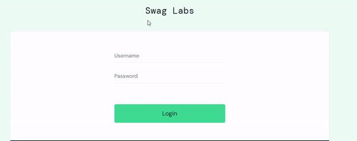
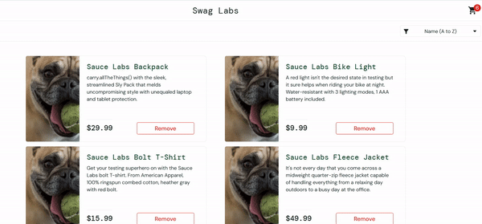
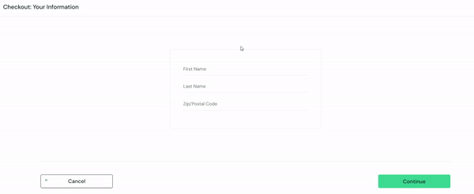
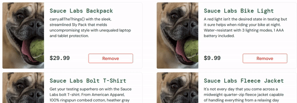
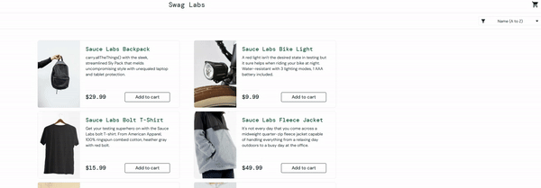
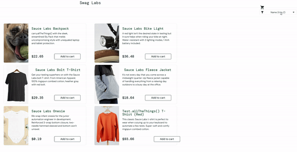

### Test Report for SauceDemo

---

### 1. Definition of the Feature to be Tested
The feature under test is the core functionality of the SauceDemo platform, including:
- User Authentication (Login/Logout)
- Product Management (Adding to Cart, Removing from Cart)
- Checkout Process (Form Validation, Button State)
- UI Elements (Picture Loading)

---

### 2. Test Cases

#### Test Case 1: Login (Valid and Invalid)
- **Objective**: Verify login functionality for valid and invalid credentials.
- **Steps**:
  1. Navigate to the login page.
  2. Enter valid credentials ("standard_user", "secret_sauce") and click "Login".
  3. Log out and reattempt login with invalid credentials (e.g., "invalid_user", "wrong_password").
- **Expected Result**: 
  - Valid credentials: Redirected to the inventory page.
  - Invalid credentials: Error message displayed.

---

#### Test Case 2: Remove from Cart Functionality
- **Objective**: Verify that a product cannot be removed from the cart when encountering an error.
- **Steps**:
  1. Log in as a standard user.
  2. Add a product to the cart.
  3. Attempt to remove the product from the cart.
- **Expected Result**: The product gets removed from the cart.
- **Result**: The product remains in the cart.

---

#### Test Case 3: Checkout Form Validation
- **Objective**: Ensure the checkout form is correctly validated when filled.
- **Steps**:
  1. Add at least one product to the cart.
  2. Click the "Checkout" button.
  3. Fill in all required fields (First Name, Last Name, Postal Code) and proceed.
- **Expected Result**: The form properly check if all fields are filled.
- **Result**: The form allows navigation to the review page even if not all fields are filled.

---

#### Test Case 4: Incorrect Picture Loading
- **Objective**: Verify that all product images load correctly or display placeholders for missing images.
- **Steps**:
  1. Log in as a standard user.
  2. Navigate to the inventory page.
  3. Check for missing or incorrectly loaded product images.
- **Expected Result**: All images load correctly or show a default placeholder.
- **Result**: Wrong Image loading for the inventory.

---

#### Test Case 5: Checkout Button Disabled for Empty Cart
- **Objective**: Verify the behavior of the "Checkout" button when the cart is empty.
- **Steps**:
  1. Log in as a standard user.
  2. Ensure the cart is empty.
  3. Check if the "Checkout" button is enabled and clickable.
- **Expected Result**: The "Checkout" button is disabled if the cart is empty.
- **Result**: The "Checkout" button is disabled if the cart is empty.

---

#### Test Case 6: Sorting List Failure
- **Objective**: Validate that the sorting functionality works as expected.
- **Steps**:
  1. Log in as a standard user.
  2. Select "Price (low to high)" from the sorting dropdown.
  3. Check if the products are sorted correctly.
- **Expected Result**: Products should be sorted in ascending order of price.
- **Result**: The sorting does not arrange items correctly.

---

### 3. Documentation of Results
| Test Case                     | Status  | Observations                              |
|-------------------------------|---------|-------------------------------------------|
| Login Validation              | Passed  | Valid login works; locked-out user blocked. |
| Unable to Remove from Cart    | Failed  | Product cannot be removed due to a bug.   |
| Checkout Form Validation      | Failed  | Form accepted and proceeds correctly.     |
| Incorrect Picture Loading     | Failed  | Some images fail to load properly.        |
| Checkout Button with Empty Cart | Failed | Button remains enabled when it should be disabled. |
| Sorting List Failure          | Failed  | Sorting does not arrange items correctly. |

---

### 4. Anomaly Report
| Anomaly ID | Description                       | Severity | Status       |
|------------|-----------------------------------|----------|--------------|
| ANOM001    | Unable to remove products from cart.        | High      | Open         |
| ANOM002    | Product images fail to load.                | Medium    | Open         |
| ANOM003    | Checkout button enabled with empty cart.    | High      | Open         |
| ANOM004    | Sorting functionality not working properly. | Medium    | Open         |

---

### Conclusion
The tests uncovered multiple issues, including bugs in the cart management, image loading, and sorting functionalities. These need to be addressed to ensure a seamless user experience. Further testing is recommended to verify fixes and explore additional edge cases.
